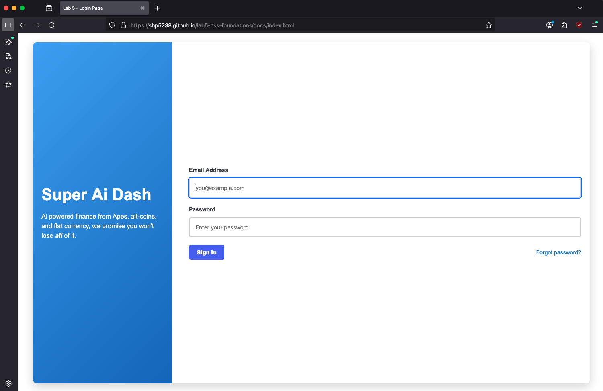
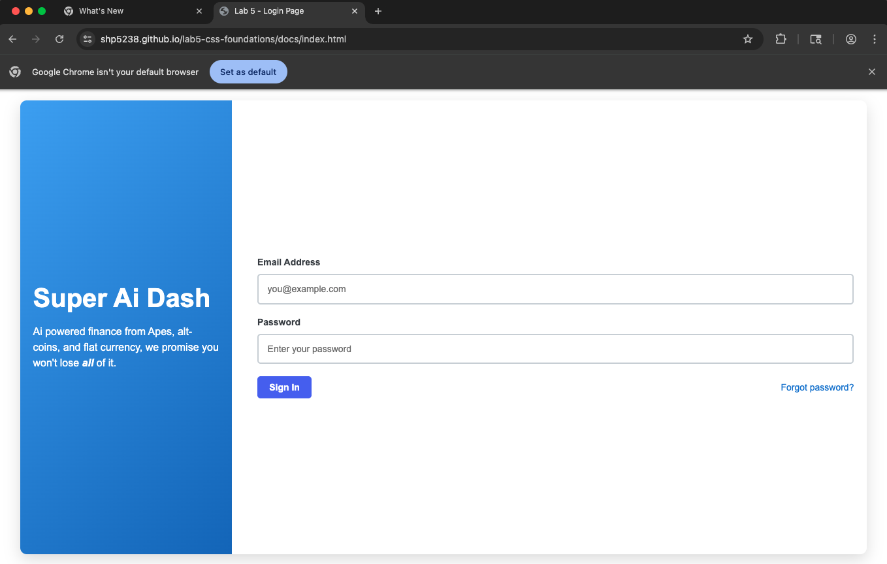
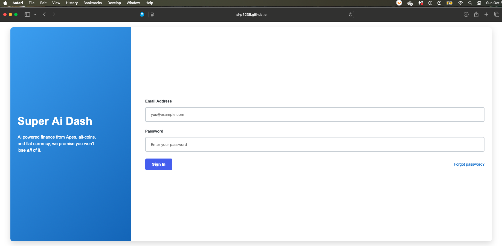
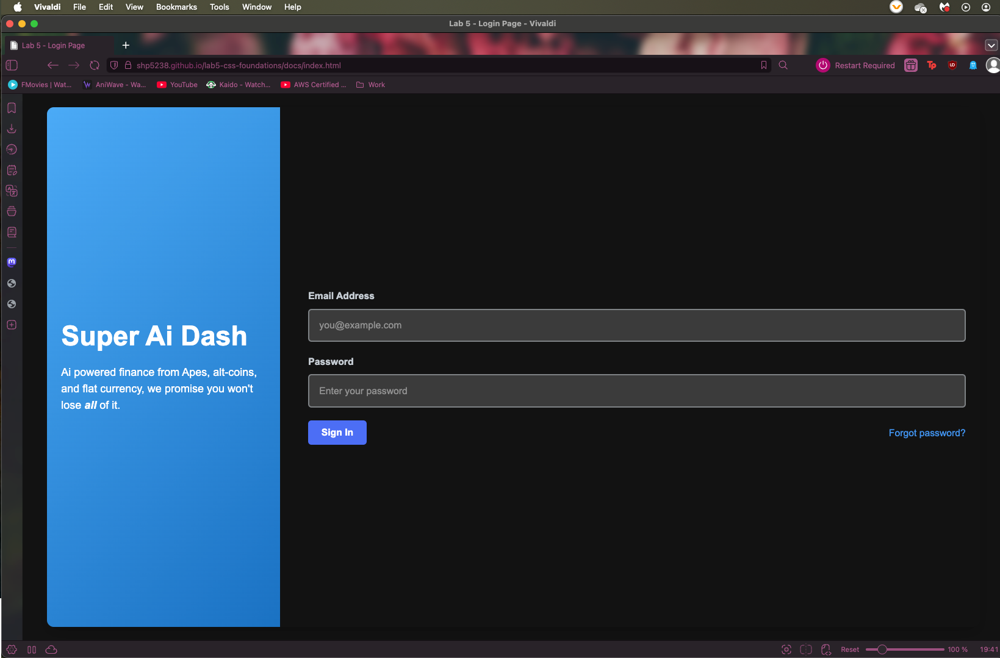

# LAB 5 Documentation
by Shreya Pasupuleti

## Core Features
- [X] Semantic HTML structure for the login page using form, labels, inputs, buttons, and headings.  
- [X] Two-column layout implemented using **CSS Grid**.  
- [X] **Flexbox** used to vertically center content within sections and align elements like buttons and inputs.  
- [X] Custom CSS variables defined for colors, font sizes, padding, and other repeated values.  
- [X] Hover states and subtle transitions implemented for interactive elements (buttons and links).  
- [X] Consistent typography, spacing, and gradient styling to match reference image.  
- [X] Outer container with shadow to emulate a card-style login box.  

## Implementation Notes & Design Decisions
- Borders were kept in **px units** to maintain visual consistency across screens.  
- Margins, gaps, and padding were manually adjusted to closely match the reference image; while not perfectly symmetrical, they ensure visual accuracy.  
- Max-width and min-height values were chosen to replicate the reference design rather than for fully fluid layout.  
- Sections were implemented using `section` tags without additional divs or headers; although HTML validator issued a warning, this approach simplified structure and maintained accessibility.  
- CSS Grid was used for the two-column layout to satisfy rubric requirements, although Flexbox alone could have achieved similar visual results.  
- CSS variables were applied primarily for values reused across the stylesheet; values unique to a single element were left as fixed numbers for clarity.  

## Main Challenges Encountered & Their Solutions
- **Vertical centering of left panel (`loginInfo`)**: Solved using Flexbox within the section.  
- **Spacing of right-hand content**: Manually adjusted margins and padding to replicate the reference image; `justify-content: space-between` helped align buttons correctly.  
- **Hover states not appearing on localhost**: Investigated discrepancies between VSCode Live Server and local server; likely caused by custom elements not being recognized.  
- **Learning curve with Flexbox**: Initially difficult to align inputs, buttons, and sections; solved by combining Flexbox for centering and spacing with CSS Grid for layout structure.  
- **Consistent typography and spacing**: Adjusted inline paragraph spacing and gradient angle to match reference design.  

## Reflection Summary
Honestly, this lab was a little challenging but also pretty fun. I learned a lot about writing semantic HTML, which made me realize how important it is to use the proper elements for forms, labels, and buttons so that all of them work the way they are supposed to. It was tricky to apply CSS Grid and Flexbox initially — especially in vertically centering the left panel and evenly spacing the buttons — but once I got the hang of using them together it started to look like the reference image. I also had an idea of when to use CSS variables and when to use fixed values, which enabled me to keep my styling more concise without over-complicating. I spent too much time tweaking margins, padding, and max-widths to align the card with the reference, which was frustrating but also a lesson in how precise you have to be in replicating a design. Making the hover effects function smoothly was satisfying, and I learned that small touches such as transitions and input focus states do a lot to make a page feel finished. Overall, I feel like I increased my knowledge of modern CSS layout techniques, interactive states, and attention to detail in design, and I'm proud that I could take a reference image and replicate it as a fully functional, styled login page.

## Links
Here is the link to my website: 
- [My code](https://shp5238.github.io/lab5-css-foundations/docs/index.html)
    - Most issues have been resolved. The site is fully functional and styled across pages.

- Alternate Pages:
    - Note: These files aren't as refined as the main project files, but still serve as a useful reference.
    - [No CSS Grid](https://shp5238.github.io/lab5-css-foundations/docs/altLayouts/login_card_no_css_grid.html)
    - [Fullscreen login](https://shp5238.github.io/lab5-css-foundations/docs/altLayouts/login_fullscreen.html)
    - [alternate stylesheet](https://shp5238.github.io/lab5-css-foundations/docs/altLayouts/styles.css)

- Color Palette used for this project: 
   [https://coolors.co/ced4da-757575-3e444a-4559a0-4baaf6-1a72c3-4c6ef5-1c7ed6](https://coolors.co/ced4da-757575-3e444a-4559a0-4baaf6-1a72c3-4c6ef5-1c7ed6)

## Screenshots
- Firefox
  

- Chrome
  

- Safari
  

- Vivaldi
  
